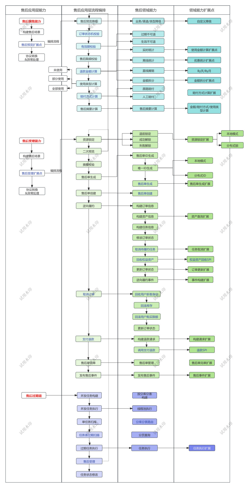

# 售后应用层能力

AfterSaleBizService：提供虚拟订单售后能力

- **预览能力**，在用户发起售后前透出预估的售后结果，如是否可退、退款金额等。

  public AfterSalePreviewResponse preview(AfterSalePreviewCmd cmd);

- **售后实际受理能力** 发起售后受理调用，可完成虚拟资产回收、逆向履约、取消订单、支付退款、营销资源回滚、库存回滚等行为。

  public AftersaleApplyResponse apply(AftersaleApplyCmd cmd);

- **售后仅退款能力** 发起售后仅退款后，仅完成支付退款，其他资源和订单不执行逆向

  public AftersaleApplyResponse apply4RefundOnly(AftersaleApplyCmd cmd);

- **过期退能力**，虚拟订单过期后，系统自定执行过期退。如未使用资产计价后退款、全部未使用自动退款、不回本包退等。

  public void triggerRefund(OnceTaskTriggerCmd cmd)

# 售后整体流程图

# 售后预览能力

扩展点：**AftersalePreviewExtension**: 售后预览阶段，系统根据业务定义的售后退款规则进行校验和金额计算，该扩展点支持各业务独立扩展售后规则

public void preview(AfterSalePreviewContext context);

## 售后预览降级流程

流程：AftersalePreviewDegradeFlow，提供售后业务+渠道的业务降级能力，降级后，用户不可发起售后。

## 售后基础校验流程

流程：AftersaleOrderMainStatusValidatePreviewFlow，状态校验等基础流程，对于状态不合法、有效期不合法等订单售后请求进行拦截

### 售后基础校验领域层能力

AfterSaleDomainService

- 状态机校验；如订单已处于退款状态不可退、未履约不可退等；AfterSaleDomainService.validateStatus
- 有效期校验；如订单处于过期状态后不可退款。AfterSaleDomainService.validatePeriod4ExpireRefundUnable

## 售后退款金额计算能力

- 售后使用金额实时计算流程；根据虚拟资产使用情况，按照均匀拆分规则对未使用资产进行计价，适合等额虚拟资产场景，如2张等价优惠券商品。
    - 流程：AfterSaleUsageAmountCompute4RealtimeFlow
    - 领域能力：计算使用情况 AfterSaleAmountService#buildUsage；
    - 领域能力；计算退款金额 AfterSaleAmountService#recommendRefundPrice
    - 扩展点：计算使用情况：_RealtimeCalculateUsageExtension_
    - 扩展点：计算退款金额：AftersaleAmountExtension#computeRefundPrice
- 售后使用金额离线计算流程；根据虚拟资产使用情况，按照总实付金额 扣掉已用资产享用的优惠总额，即为未使用资产价值。
    - 流程：AfterSaleUsageAmountCompute4OfflineStatisticsFlow
- 售后使用金额按已用时间摊销计算流程; 将虚拟资产的净成本在其估计使用时间内平均摊销‌。如有效期30天，将实付金额摊销在30天内，按照已用天数计算退款金额。
    - 流程: AfterSaleUsageAmountCompute4StraightLineFlow

## 售后方式

- 售后使用类型计算；根据使用金额，分为未使用、已使用、全部已使用等状态。AfterSaleUsageTypeComputeFlow
- 售后使用类型计算；根据时间、资产状态、已用优惠状态，分为未使用、已使用、全部已使用等状态。AfterSaleUsageTypeComputeFlow
- 售后赔付方式计算；根据使用类型，由业务定义售后赔付方式，分为原路赔付、人工客服赔付等。
    - 流程：AftersaleRefundWayComputeFlow
    - 扩展点：AftersaleAmountExtension#calculateRefundWay

## 售后一致性校验

- 计算售后计划摘要；
    - 什么是摘要：由订单ID、售后赔付方式、售后赔付金额计算摘要值；
    - 为什么要计算摘要：售后预览阶段返回的退款金额和 实际售后阶段的退款金额可能不一致；
        - 如临近订单过期，订单过期后不可退。
        - 用户在其他客户端用券后，发起售后，导致预览和实际退款金额前后退款金额不一致。
    - 何时校验摘要？预览阶段计算好摘要后，客户端发起售后带上该摘要，受理阶段再次校验，确保两次一致才会进行退款
      否则有用户重新发起预览，然后再次提交售后
- 计算售后计划摘要流程；
    - 流程：AftersalePlanDigestGenerateFlow
    - 扩展点：GenerateAfterSalePlanDigestExtension#generateDigest

# 售后受理能力

扩展点：AfterSaleApplyExtension；支持售后受理能力扩展，业务可自定义售后受理流程。

## 资源锁定

避免售后流程中其他请求（系统重试或用户请求）并发修改订单导致的数据不一致风险，应在售后开始前进行资源锁定。

- 流程：对订单加分布式锁AfterSaleResourceLockFlow
- 领域能力 售后受理前加锁 ，MemberTradeLockService#lockOnPreAfterSale
- 领域能力 售后完成取消锁，MemberTradeLockService#unlockOnAfterSaleSuccess
- 扩展点：LockExtension 锁扩展点，由业务扩展是否加锁、解锁，默认加锁

## 售后预览和一致性校验

售后受理阶段会重新计算订单的可退金额，如果和售后预览阶段不一致则不允许发起售后。

- 流程：售后受理一致性校验 AfterSalePlanDigestCheckFlow

## 售后单管理

售后受理阶段包含售后单创建、逆向履约、取消订单、支付退款、完成售后等阶段，需要通过售后单状态机进行流程管控

**流程**

- 流程：售后单生成流程。AftersaleOrderGenerateFlow
- 流程：售后单创建和完单。AftersaleOrderApplyFlow

**领域能力**

- 领域能力：AfterSaleDomainService#generateOrder 生成售后单
- 领域能力：AfterSaleDomainService#createAfterSaleOrder 创建售后单
- 领域能力：createAfterSaleOrder#onPerformReversed 逆向履约成功
- 领域能力：createAfterSaleOrder#onPurchaseReversed 取消订单成功
- 领域能力：createAfterSaleOrder#onPayRefundSuccess 支付退款成功
- 领域能力：createAfterSaleOrder#onAftersaleSuccess 售后成功

**扩展点**

扩展点：售后单仓储层扩展点。AfterSaleRepositoryExtension 根据业务场景决定如何更新售后单（提供默认实现）

- 完单 AfterSaleRepositoryExtension#onSuccess
- 支付退款完成 AfterSaleRepositoryExtension#onRefundSuccess

## 售后逆向履约

完成订单的逆向履约，包括虚拟资产回收、权益资格回收、周期发放任务取消等动作。

- 售后受理触发逆向履约流程。AftersaleReversePerformFlow
- 逆向履约流程层编排扩展点。ReversePerformExtension
  public void reverse(ReversePerformContext context);

**流程**

- 构建逆向履约上下文。ReversePerformContextInitializeFlow
    - 查询会员单、子单信息 。PerformDomainService#extractMemberOrderDO
    - 查询虚拟资产。
        - 扩展点：查询虚拟资产。BuildReverseInfoExtension
        - 领域能力：查询虚拟资产；PerformDomainService#buildReversePerformAssetsInfo
    - 查询待履约任务
        - 扩展点：BuildReverseInfoExtension
        - 领域能力：查询待生效任务 PeriodPerformTaskDomainService#buildActivePeriodTasks
- 取消待履约任务；PeriodPerformTaskCancelFlow
    - 领域能力：取消待履约任务 PeriodPerformTaskDomainService#cancelActivatPeriodTasks
    - 扩展点：周期任务仓储层扩展点；PeriodPerformTaskRepositoryExtension#onCancel
- 回收虚拟资产和权益
    - 流程：履约项管理包含开始回收和回收成功的状态机管理 PerformItemReverseFlow
        - 领域能力：MemberPerformItemDomainService#onStartReversePerform
        - 领域能力：MemberPerformItemDomainService#onReversePerformSuccess
    - 流程：资产回收流程 AssetsReverseFlow
    - 扩展点：权益回收扩展点，调用权益履约方回收权益方法。RightsReverseExtension

## 售后取消订单

完成取消订单流程，包括订单状态、优惠资源、库存回滚等动作

**流程**

- 回收用户新客身份 PurchaseNewMemberReverseFlow
    - 领域能力：取消用户新客标记 NewMemberDomainService#unmark
    - 领域能力：用户身份标签管理 UserTagService#operate
- 回滚库存流程 PurchaseInventoryOperateReverseFlow
    - 领域能力：库存管理 InventoryBizService#operateSkuInventory
- 回收购买配额流程 PurchaseMemberQuotaReverseFlow
    - 领域能力：回滚用户购买限额 QuotaDomainService#onReverse
    - 扩展点：构建用户标签操作上下文，QuotaExtension#buildUserTagOp
    - 领域能力：购买配额能力复用用户标签能力 UserTagService#operate

## 售后支付退款

完成支付退款。AfterSalePayOrderRefundFlow

- 领域能力：支付退款能力 PayementService
- SPI接口: 抽象出支付退款调用接口SPI，根据实际的支付渠道进行适配 PaymentFacadeSPI
- 扩展点： 支付退款请求构建扩展点 PaymentExtension

# 售后仅退款能力

在部分场景需要提供仅退款能力，如支付完成后发现订单已经支付超时取消了，此时订单处于关单状态，需要对已经支付的订单退款。

以下为操作流程

## 资源锁定

避免售后流程中其他请求（系统重试或用户请求）并发修改订单导致的数据不一致风险，应在售后开始前进行资源锁定。

- 流程：对订单加分布式锁AfterSaleResourceLockFlow
- 领域能力 售后受理前加锁 ，MemberTradeLockService#lockOnPreAfterSale
- 领域能力 售后完成取消锁，MemberTradeLockService#unlockOnAfterSaleSuccess
- 扩展点：LockExtension 锁扩展点，由业务扩展是否加锁、解锁，默认加锁

## 售后预览

仅退款的售后请求需要再售后预览阶段生成售后计划，标记该请求仅需要支付退款。同时进行防御性编程。如订单处于履约状态不允许仅退款（默认严格校验，通过配置可放开）

扩展点 ：AfterSale4OnlyRefundPreviewExtension 该扩展点实现中标记了订单赔付方式为原路赔付、退款金额为全额退款。

## 售后单管理

售后受理阶段包含售后单创建、逆向履约、取消订单、支付退款、完成售后等阶段，需要通过售后单状态机进行流程管控

**流程**

- 流程：售后单生成流程。AftersaleOrderGenerateFlow
- 流程：售后单创建和完单。AftersaleOrderApplyFlow

**领域能力**

- 领域能力：AfterSaleDomainService#generateOrder 生成售后单
- 领域能力：AfterSaleDomainService#createAfterSaleOrder 创建售后单
- 领域能力：createAfterSaleOrder#onPerformReversed 逆向履约成功
- 领域能力：createAfterSaleOrder#onPurchaseReversed 取消订单成功
- 领域能力：createAfterSaleOrder#onPayRefundSuccess 支付退款成功
- 领域能力：createAfterSaleOrder#onAftersaleSuccess 售后成功

**扩展点**

扩展点：售后单仓储层扩展点。AfterSaleRepositoryExtension 根据业务场景决定如何更新售后单（提供默认实现）

- 完单 AfterSaleRepositoryExtension#onSuccess
- 支付退款完成 AfterSaleRepositoryExtension#onRefundSuccess

## 支付退款

完成支付退款。AfterSalePayOrderRefundFlow

- 领域能力：支付退款能力 PayementService
- SPI接口: 抽象出支付退款调用接口SPI，根据实际的支付渠道进行适配 PaymentFacadeSPI
- 扩展点： 支付退款请求构建扩展点 PaymentExtension

# 售后过期退能力

虚拟订单场景需要提供过期售后能力，包括无条件过期退，不回本过期图，未使用过期退能力。系统在实现过期退能力时借助于
任务组件的定时触发能力，在履约阶段记录过期退任务，在订单过期后，系统会扫描到该笔订单需要进行退款。

- 扩展点：OnceTaskTriggerExtension
- 默认过期退扩展点，DefaultExpireRefundTriggerExtension

## 过期退流程

任务并发触发流程 OnceTaskConcurrentTriggerFlow

- 构建任务由线程池并发执行扫描数据库，获取过期的订单
- 扫描时需要考虑分库分表，因此要设置分库分表标记（sharding-jdbc ）OnceTaskForceRouterFlow
- 扫描数据库任务表 OnceTaskScanFlow
- 过期退领域能力：OnceTaskDomainService#scanTasks

## 过期退任务执行

- 过期退任务执行领域能力 OnceTaskDomainService#execute
- 过期退任务执行扩展点 OnceTaskTriggerExtension
    - 过期退提供了任务执行实现 DefaultExpireRefundTriggerExtension
- 过期退执行任务状态管理 OnceTaskManageExecuteFlow
    - 领域能力：开始执行 OnceTaskDomainService#onStartExecute
    - 领域能力：执行成功 OnceTaskDomainService#onExecuteSuccess
    - 领域能力：执行失败 OnceTaskDomainService#onExecuteFail
- 过期退执行售后受理流程：AftersaleOnceTaskExecute4ExpiredRefundFlow
    - 该流程最终调用 售后应用层能力发起售后 AfterSaleBizService#apply

